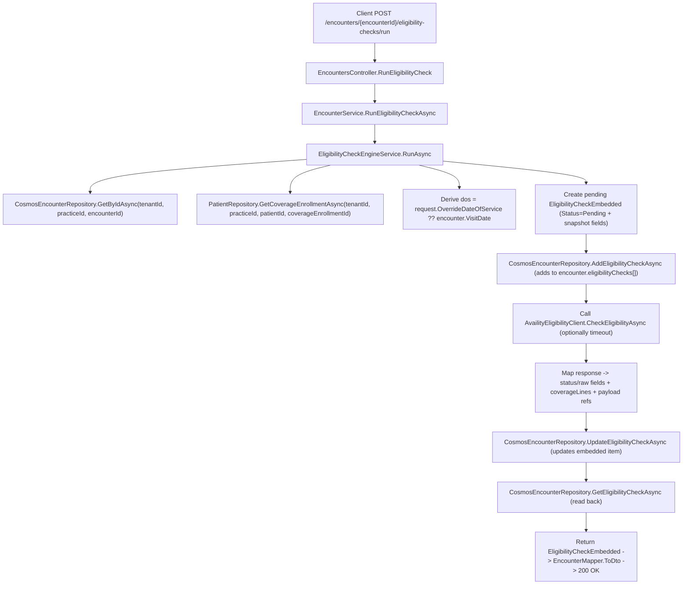

## End-to-end data flow: `EncountersController.RunEligibilityCheck` → Cosmos (and back)

This traces **every related input property**, **intermediate (derived) values**, and the **exact Cosmos-stored fields** that get written under the `Encounter` document.

---

## 1) HTTP endpoint + inputs (Controller)

**Route**
- `POST /api/practices/{practiceId}/encounters/{encounterId}/eligibility-checks/run?timeoutSeconds={int?}`

**Inputs**
- Route:
  - `practiceId` (string)
  - `encounterId` (string)

- Auth-derived:
  - `tenantId` (string) from `User.GetTenantIdOrThrow()`
  - Practice authorization enforced by `User.EnsurePracticeAccessOrThrow(practiceId)`

- Query:
  - `timeoutSeconds` (int?) → converted to `TimeSpan? timeout`

- Body: `EligibilityCheckRequestDto`
  - `CoverageEnrollmentId` (string, required)
  - `OverrideDateOfService` (`DateTime?`)
  - `ServiceTypeCodes` (`List<string>?`)
  - `ForceRefresh` (`bool`) **(note: not used downstream in current engine)**

**Call chain**
- Controller → `IEncounterService.RunEligibilityCheckAsync(tenantId, practiceId, encounterId, request, cancellationToken, timeout)`

---

## 2) Service layer (EncounterService)

`EncounterService.RunEligibilityCheckAsync(...)`:
- Validates arguments
- Delegates orchestration to:
  - `_eligibilityEngine.RunAsync(tenantId, practiceId, encounterId, request, cancellationToken, timeout)`

No additional properties are added here.

---

## 3) Engine orchestration + intermediate values (EligibilityCheckEngineService)

### A) Load + validate prerequisites
1) Load encounter (Cosmos read):
- `_encounterRepo.GetByIdAsync(tenantId, practiceId, encounterId)`

**Important isolation behavior**
- Cosmos partition key is `tenantId`
- Repository explicitly checks that `encounter.PracticeId == practiceId` or returns `null`

2) Load coverage enrollment (Patient repo):
- `_patientRepo.GetCoverageEnrollmentAsync(tenantId, practiceId, encounter.PatientId, request.CoverageEnrollmentId)`

### B) Derived/intermediate values
- **Derived Date of Service (`dos`)**
  - `dos = request.OverrideDateOfService ?? encounter.VisitDate`

- **Pending eligibility check object** (`EligibilityCheckEmbedded pending`) populated from:
  - Request
  - Encounter
  - Coverage enrollment

**Pending check fields set (intermediate, prior to Availity call):**
- `CoverageEnrollmentId` = `request.CoverageEnrollmentId`
- `PayerId` = `coverage.PayerId`
- `DateOfService` = `dos`
- `RequestedAtUtc` = `DateTime.UtcNow`
- `Status` = `"Pending"`
- Snapshot fields sourced from the coverage enrollment:
  - `MemberIdSnapshot` = `coverage.MemberId`
  - `GroupNumberSnapshot` = `coverage.GroupNumber`
  - `EffectiveDateSnapshot` = `coverage.EffectiveDate`
  - `TerminationDateSnapshot` = `coverage.TerminationDate`
- Initialized:
  - `PlanNameSnapshot` = `null`
  - `CoverageLines` = `[]`
  - `Payloads` = `[]`

3) Persist pending check inside the encounter document:
- `_encounterRepo.AddEligibilityCheckAsync(...)`
  - If `EligibilityCheckId` is blank, repository assigns:
    - `EligibilityCheckId = Guid.NewGuid().ToString("n")`
  - Repository also sets:
    - `RequestedAtUtc = DateTime.UtcNow` (again)

So at this point, Cosmos has an `Encounter` document update with a new element in `eligibilityChecks[]` representing the pending check.

### C) Prepare Availity request (intermediate external request model)
`AvailityEligibilityRequest` created from coverage + request:
- `PayerId` = `coverage.PayerId`
- `MemberId` = `coverage.MemberId`
- `GroupNumber` = `coverage.GroupNumber`
- `DateOfService` = `dos`
- `SubscriberFirstName` = `coverage.SubscriberFirstName`
- `SubscriberLastName` = `coverage.SubscriberLastName`
- `SubscriberDob` = `coverage.SubscriberDob`
- `ServiceTypeCodes` = `request.ServiceTypeCodes`

### D) Cancellation + timeout behavior (intermediate control flow)
- If `timeout` provided, engine creates a linked `CancellationTokenSource`, calls `cts.CancelAfter(timeout.Value)`, and uses that token for `_availityClient.CheckEligibilityAsync(...)`.

### E) Receive Availity response and normalize (mapping step)
`AvailityEligibilityResponse response` is mapped into the embedded check fields.

Normalization:
- `CoverageLines` are mapped via `MapCoverageLines(response)`:
  - Each Availity line becomes `CoverageLineEmbedded` with:
    - `ServiceTypeCode` = `line.ServiceTypeCode`
    - `CoverageDescription` = `line.CoverageType`  *(note: this is “type”, not the human description used in seed data)*
    - `NetworkIndicator` = `"IN" | "OUT" | (raw)`
    - `AdditionalInfo` = `line.Notes` (+ sometimes amount text)
    - And best-effort numeric parsing:
      - `CopayAmount`, `DeductibleAmount`, `AllowanceAmount`, `CoinsurancePercent` based on `CoverageType` + `Amount`

Payload refs:
- If `response.PayloadRefs` exists, engine converts each to an `EligibilityPayloadEmbedded` with:
  - `PayloadId` = new guid `"n"`
  - `Direction` = `p.Direction`
  - `Format` = `p.Format`
  - `StorageUrl` = `p.StorageUrl`
  - `CreatedAtUtc` = now

### F) Update the embedded eligibility check record in Cosmos
Repository call:
- `_encounterRepo.UpdateEligibilityCheckAsync(..., checkId, embedded => { ... })`

Fields updated:
- `CompletedAtUtc` = `DateTime.UtcNow`
- `Status` = `"Succeeded"` if `response.ErrorMessage` empty else `"Failed"`
- `RawStatusCode` = `response.RawStatusCode`
- `RawStatusDescription` = `response.RawStatusDescription`
- Snapshot updates (response overrides existing snapshots if provided):
  - `PlanNameSnapshot` = `response.PlanName ?? existing`
  - `EffectiveDateSnapshot` = `response.EffectiveDate ?? existing`
  - `TerminationDateSnapshot` = `response.TerminationDate ?? existing`
- `ErrorMessage` = `response.ErrorMessage`
- `CoverageLines` = mapped list
- `Payloads` appended (if any)

Failure paths:
- Timeout (OperationCanceledException not caused by caller cancellation):
  - Marks check `Failed` + `ErrorMessage = "Availity request timed out."`
- Other exception:
  - Marks check `Failed` + `ErrorMessage = ex.Message`

Finally, engine reads it back:
- `_encounterRepo.GetEligibilityCheckAsync(...)` and returns the embedded check.

---

## 4) Cosmos DB storage: exact stored properties (Encounter document)

All eligibility data is stored **embedded** inside the `Encounter` document:

### Encounter-level fields relevant to this flow
Stored in container `encounters` (partition key `/tenantId`):

- `id` (encounter id)
- `tenantId`
- `practiceId`
- `patientId`
- `visitDate`
- … and most importantly:
- `eligibilityChecks`: `EligibilityCheckEmbedded[]`

### Stored eligibility check shape (Cosmos JSON)
Each run adds/updates one item in:

- `encounter.eligibilityChecks[]` where item includes:

**Top-level**
- `eligibilityCheckId` *(generated if missing)*
- `coverageEnrollmentId` *(from request)*
- `payerId` *(from coverage enrollment)*
- `dateOfService` *(derived: override DOS or encounter.VisitDate)*
- `requestedAtUtc` *(set when added)*
- `completedAtUtc` *(set after Availity result or on failure)*
- `status` = `"Pending" | "Succeeded" | "Failed"`
- `rawStatusCode` *(from Availity response)*
- `rawStatusDescription` *(from Availity response)*

**Snapshots (saved for historical traceability)**
- `memberIdSnapshot` *(from coverage enrollment)*
- `groupNumberSnapshot` *(from coverage enrollment)*
- `planNameSnapshot` *(from Availity response if present)*
- `effectiveDateSnapshot` *(coverage enrollment initially; can be overridden by response)*
- `terminationDateSnapshot` *(coverage enrollment initially; can be overridden by response)*
- `errorMessage` *(from Availity response or exception)*

**Coverage lines**
- `coverageLines[]` items with:
  - `serviceTypeCode`
  - `coverageDescription`
  - `copayAmount`
  - `coinsurancePercent`
  - `deductibleAmount`
  - `remainingDeductible` *(not set by engine currently)*
  - `outOfPocketMax` *(not set by engine currently)*
  - `remainingOutOfPocket` *(not set by engine currently)*
  - `allowanceAmount`
  - `networkIndicator`
  - `effectiveDate` *(not set by engine currently)*
  - `terminationDate` *(not set by engine currently)*
  - `additionalInfo`

**Payload refs**
- `payloads[]` items with:
  - `payloadId` *(generated)*
  - `direction`
  - `format`
  - `storageUrl`
  - `createdAtUtc`

> Indexing note (from seed setup): Cosmos indexing excludes deep `eligibilityChecks/[]/payloads/*` and `eligibilityChecks/[]/coverageLines/[]/additionalInfo/?` to reduce RU, but the fields are still stored.

---

## 5) API response mapping (what is returned)

Controller returns:
- `Ok(check.ToDto())`

`EncounterMapper.ToDto(EligibilityCheckEmbedded)` outputs `EligibilityCheckResponseDto` with:

- `EligibilityCheckId`
- `CoverageEnrollmentId`
- `PayerId`
- `DateOfService`
- `RequestedAtUtc`
- `CompletedAtUtc`
- `Status`
- `PayerName` = `null` (TODO)
- `RawStatusCode`
- `RawStatusDescription`
- `MemberIdSnapshot`
- `GroupNumberSnapshot`
- `PlanNameSnapshot`
- `EffectiveDateSnapshot`
- `TerminationDateSnapshot`
- `ErrorMessage`
- `CoverageLines` (mapped; **payloads are not returned here**)

---

## Mermaid diagram: end-to-end flow

---

If you want, I can also output a **“field lineage table”** (each Cosmos JSON field → exact source: request/coverage/encounter/Availity/derived) to make audits/debugging faster.